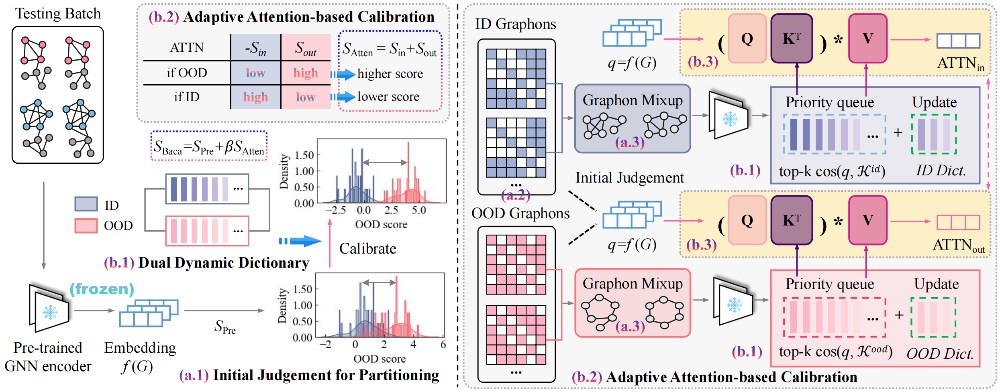

# [AAAI 2026] Graph Out-of-Distribution Detection via Test-Time Calibration with Dual Dynamic Dictionaries
This repository is the official implementation of "[Graph Out-of-Distribution Detection via Test-Time Calibration with Dual Dynamic Dictionaries](https://arxiv.org/abs/2503.03241)" accepted by the 40th Annual AAAI Conference on Artificial Intelligence (AAAI 2026).

[](https://arxiv.org/abs/2503.03241)

------

## 0. Abstract
A key challenge in graph out-of-distribution (OOD) detection lies in the absence of ground-truth OOD samples during training. Existing methods are typically optimized to capture features within the in-distribution (ID) data and calculate OOD scores, which often limits pre-trained models from representing distributional boundaries, leading to unreliable OOD detection. Moreover, the latent structure of graph data is often governed by multiple underlying factors, which remains less explored. To address these challenges, we propose a novel test-time graph OOD detection method, termed **BaCa**, that calibrates OOD scores using dual dynamically updated dictionaries without requiring fine-tuning the pre-trained model. Specifically, BaCa estimates graphons and applies a mix-up strategy solely with test samples to generate diverse boundary-aware discriminative topologies, eliminating the need for exposing auxiliary datasets as outliers. We construct dual dynamic dictionaries via priority queues and attention mechanisms to adaptively capture latent ID and OOD representations, which are then utilized for boundary-aware OOD score calibration. To the best of our knowledge, extensive experiments on real-world datasets show that BaCa significantly outperforms existing state-of-the-art methods in OOD detection.


## 1. Requirements

Main package requirements:

- `CUDA == 11.1`
- `Python == 3.7.12`
- `PyTorch == 1.8.0`
- `PyTorch-Geometric == 2.0.0`

To install the complete requiring packages, use the following command at the root directory of the repository:

```setup
pip install -r requirements.txt
```


## 2. Quick Start
Just run the script corresponding to the experiment and dataset you want. For instance:

* Run out-of-distribution detection on all dataset pairs:
```bash
bash script/run.sh
```


## 3. Citation
If you find this repository helpful, please consider citing the following paper. We welcome any discussions with [hou_yue@buaa.edu.cn](mailto:hou_yue@buaa.edu.cn).

```bibtex

```
